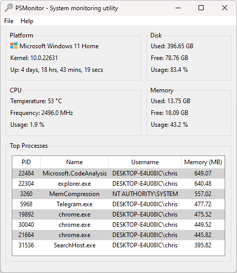

# psmonitor

A simple system and network monitoring solution with a built-in server for remote monitoring capabilities.




View an example [web client dashboard here](https://github.com/sentrychris/system-monitor)

## Features

- **Asynchronous Data Collection**: Efficient, non-blocking data collection.
- **Real-Time Monitoring**: Transmits live system and network statistics.
- **System Statistics**: Provides CPU, memory, and disk usage, uptime, and top processes.
- **Network Statistics**: Monitors data sent and received on network interfaces.
- **Websocket Server**: Includes a [tornado](https://www.tornadoweb.org/en/stable/) server for remote monitoring (built-in and standalone).


## Desktop application

The desktop application is built with [Tkinter](https://docs.python.org/3/library/tkinter.html), Python's binding to the Tk GUI toolkit, it consists of:

- **Core logic**: The collection of modules, scripts and binaries that are used to provide the functionality.
- **The server**: Used by the app to receive data to display, but can also be run as its own standalone service.

## Server

The server manages the execution of the monitoring scripts, using multiple threads managed through an executor to retrieve data asynchronously and mitigate blocking operations from calls to read system data.

The server is built with [tornado](#), a scalable, non-blocking web server designed to handle a large number of concurrent connections. It's non-blocking nature makes it ideal for building real-time services.

### HTTP

Three standard HTTP endpoints are provided:

#### **GET `/system`**:

Retrieves system monitoring information

- **CPU**: Temperature, Frequency, Usage
- **Disk**: Used, Free, Total, Usage
- **Mem**: Used, Free, Total, Usage
- **User**: Logged in user
- **Platform**: Distribution, Kernel, Uptime
- **Processes** Top 10 processes by memory usage


> A small note on CPU temperature monitoring on Windows: reading temperature sensors requires elevated privileges, in order to display your CPU temperature on Windows, you'll need to run PSMonitor as an administrator.
> 
> PSMonitor uses a tiny binary executable called [**libwincputemp**](./lib/libwincputemp/), which is part of this project.

#### **GET `/network`**:

Retrieves network monitoring information:
- **Interfaces**: Visible network interfaces
- **Wireless**: Name, Quality, Channel, Encryption, Address, Signal
- **Statistics**: For each interface: MB sent, MB received, packets sent, packets received, errors receiving packets, error sending packets, dropout rate.

#### **GET `/`**:
Renders a simple dashboard to check or test the server.

#### **POST `/`**:
Creates a worker to manage the execution of monitoring scripts. Responds with a worker ID which is then used in the websocket connection endpoint URL (below).


### Websocket

One singular websocket endpoint is provided (realtime network monitoring is yet to be implemented).

#### WS `/connect?id={<worker_id>}`

- Creates the websocket connection, data immediately begins being sent through the connection.

### Running the server as a managed process

If you would like to run the server as a managed process, you can use the systemd service file provided.

1. Copy the service file and make any necessary changes:
    ```sh
    sudo cp ./psmonitor.service /etc/systemd/system/
    ```

2. Reload the daemon to recognize the new service:
    ```sh
    sudo systemctl daemon-reload
    ```

3. Start the service:
    ```sh
    sudo systemctl start psmonitor
    ```

Alternatively, you could use [supervisor](http://supervisord.org/) or something similar.


### Connecting to the server from your own app

To connect to the WebSocket server, you can use any WebSocket client. Here is an example of how to connect using JavaScript:

1. Retrieve the assigned worker:

    ```js
    const client = await fetch(`http://<server-address>`, {
        method: 'POST',
        body: { connection: 'monitor' }
    });
    const worker = await client.json()
    ```

2. Open the WebSocket connection and retrieve data:
    ```js
    const url = `ws://<server-address>:<port>/ws?id=${worker.id}`;

    connection = new WebSocket(url);
    connection.onopen = () => {
        log.write('event', 'websocket is connected');
    }
    connection.onmessage = (response) => {
        const data = JSON.parse(response.data);
    }
    ```

You can also use WebSocket clients in other programming languages, such as Python:

1. Retrieve an assigned worker:

    ```python
    import requests

    response = requests.post('http://<server-address>', json={'connection': 'monitor'})
    worker = response.json()
    ```

2. Open the WebSocket connection and retrieve data:
    ```python
    import asyncio
    import websockets

    async def connect():
        uri = f"ws://<server-address>:<port>/ws?id={worker['id']}"
        async with websockets.connect(uri) as websocket:
            async for message in websocket:
                print(message)

    asyncio.run(connect())
    ```

You can use the quick dashboard located at `public/web.html`  for further testing and exploration.

If you are using the [system monitor web client](https://github.com/sentrychris/system-monitor), there are instructions contained there to help you get setup and connected.

I hope you like it!

## License
This software is open-sourced software licensed under the MIT license.

## Credits

This software uses [LibreHardwareMonitorLib.dll](https://github.com/LibreHardwareMonitor/LibreHardwareMonitor) in order to provide CPU temperature readings on Windows. The DLL forms part of the **libwincputemp** program which is part of this project. LibreOpenHardwareMonitor is licensed under MPL 2.0, a copy of the license can be found in the [third-party licenses file](./THIRD_PARTY_LICENSES).