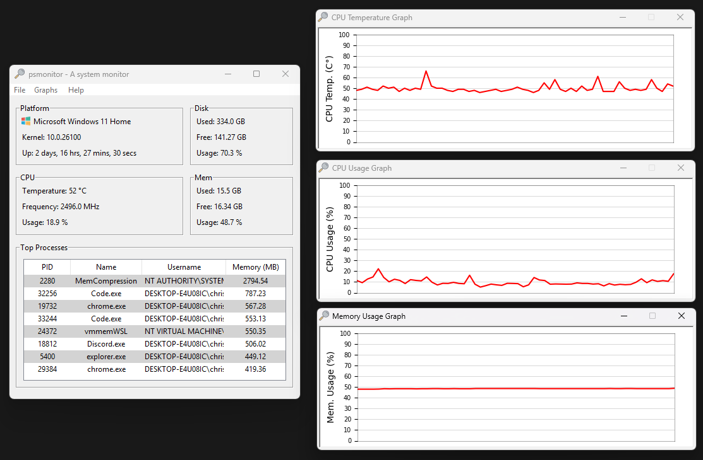

# psmonitor

[](https://github.com/sentrychris/psmonitor/actions/workflows/github-code-scanning/codeql)

A simple system and network monitoring app with a headless server for remote monitoring capabilities.



View an example [web client dashboard here](https://github.com/sentrychris/system-monitor)

## Features

- **Asynchronous Data Collection**: Efficient, non-blocking data collection.
- **Real-Time Monitoring**: Transmits live system and network statistics.
- **System Statistics**: Provides CPU, memory, and disk usage, uptime, and top processes.
- **Network Statistics**: Monitors data sent and received on network interfaces.
- **Websocket Server**: For remote monitoring on your local network or through port forwarding.


## GUI Application

The desktop application is built with [Tkinter](https://docs.python.org/3/library/tkinter.html), Python's binding to the Tk GUI toolkit, it consists of:

- **Core logic**: The collection of modules, scripts and binaries that are used to provide the functionality.
- **The server**: Used by the app to receive data to display, but can also be run as its own headless service.

## Headless Server

The server manages the execution of the monitoring scripts, using multiple threads managed through an executor to retrieve data asynchronously and mitigate blocking operations from calls to read system data.

The server is built with [tornado](#), a scalable, non-blocking web server designed to handle a large number of concurrent connections.

While the server is embedded in the desktop GUI application, a [headless version](https://github.com/sentrychris/psmonitor/releases/download/v1.4.0.1551/psmonitor-standalone-server-no-gui.exe) is provided for people who want to build their own UI clients, or for people who want to setup remote monitoring either on the local network or through port forwarding.

### HTTP

Three standard HTTP endpoints are provided:

#### **GET `/system`**:

Retrieves system monitoring information

- **CPU**: Temperature, Frequency, Usage
- **Disk**: Used, Free, Total, Usage
- **Mem**: Used, Free, Total, Usage
- **User**: Logged in user
- **Platform**: Distribution, Kernel, Uptime
- **Processes** Top 10 processes by memory usage


> A small note on CPU temperature monitoring on Windows: reading temperature sensors requires elevated privileges, in order to display your CPU temperature on Windows, you'll need to run psmonitor as an administrator.
> 
> psmonitor uses a tiny binary executable called [**libwincputemp**](./lib/libwincputemp/), which is part of this project.

#### **GET `/network`**:

Retrieves network monitoring information:
- **Interfaces**: Visible network interfaces
- **Wireless**: Name, Quality, Channel, Encryption, Address, Signal
- **Statistics**: For each interface: MB sent, MB received, packets sent, packets received, errors receiving packets, error sending packets, dropout rate.

#### **GET `/`**:
Renders a simple dashboard to check or test the server.

#### **POST `/`**:
Creates a worker to pair HTTP connections to websocket sessions and manage execution of monitoring scripts. This endpoint responds with a worker ID which is then used in the websocket connection (below).


### Websocket

A single websocket endpoint is provided.

#### WS `/connect?id={<worker_id>}`

- Creates and connects to the websocket connection, data immediately begins being sent through the connection.

### Running the headless server as a managed process

If you would like to run the [headless server](https://github.com/sentrychris/psmonitor/releases/download/v1.4.0.1551/psmonitor-standalone-server-no-gui.exe) as a managed process, you can use the systemd [service file](./package/server/linux/psmonitor.service) provided.

1. Copy the service file and make any necessary changes:
    ```sh
    sudo cp ./psmonitor.service /etc/systemd/system/
    ```

2. Reload the daemon to recognize the new service:
    ```sh
    sudo systemctl daemon-reload
    ```

3. Start the service:
    ```sh
    sudo systemctl start psmonitor
    ```

Alternatively, you could use [supervisor](http://supervisord.org/) or something similar.


### Connecting to the headless server from your own app

To connect to the server, you can use any client or language.

#### JavaScript Example

1. Retrieve the assigned worker:

    ```js
    const client = await fetch(`http://<server-address>`, {
        method: 'POST',
        body: { connection: 'monitor' }
    });
    const worker = await client.json()
    ```

2. Open the WebSocket connection and retrieve data:
    ```js
    const url = `ws://<server-address>:<port>/ws?id=${worker.id}`;

    connection = new WebSocket(url);
    connection.onopen = () => {
        log.write('event', 'websocket is connected');
    }
    connection.onmessage = (response) => {
        const data = JSON.parse(response.data);
    }
    ```

#### Python Example

1. Retrieve an assigned worker:

    ```python
    import requests

    response = requests.post('http://<server-address>', json={'connection': 'monitor'})
    worker = response.json()
    ```

2. Open the WebSocket connection and retrieve data:
    ```python
    import asyncio
    import websockets

    async def connect():
        uri = f"ws://<server-address>:<port>/ws?id={worker['id']}"
        async with websockets.connect(uri) as websocket:
            async for message in websocket:
                print(message)

    asyncio.run(connect())
    ```

You can use the quick dashboard located at `src/gui/web/web.html`  for further testing and exploration.

I hope you like it!

## Building from Source

To build psmonitor from source.

Step 1: Clone the repository
```sh
git clone --recurse-submodules https://github.com/sentrychris/psmonitor.git
```

Step 2: Install submodules (all located in `src/lib/`)
```sh
git submodule update --init --recursive
```

Step 3: Install dependencies
```sh
pip install -r requirements.txt
```

Step 4: Run the `build.py` script to generate a single-file executable:

- GUI: (builds the GUI monitoring app with embedded monitoring server):
    ```sh
    python build.py gui --clean --upx=<upx-ver>
    ```

- Headless: (builds only the headless monitoring server without the GUI app);
    ```sh
    python build.py headless --clean --upx=<upx-ver>
    ```

Pass `--clean` if you want to clean the previous build directories. Pass `--upx=<upx-ver>` if you want to use UPX to compress when packing the executable, if you don't pass a UPX version then it will use the latest available release.


## How it works

1. The GUI app calls `start_server()` which starts the Tornado app in a background thread.
2. Tornado starts listening on port 4500 for both HTTP and Websocket connections.
3. The GUI app makes an HTTP request to the `/system` endpoint to fetch initial data to display.
4. The GUI app then makes an HTTP post request to `/` to setup a new websocket connection.
5. The Tornado app creates a new session worker for the websocket session and passes the worker ID back to the GUI app.
6. The GUI app opens the new websocket connection to the server, using the worker ID to identify and manage the session.
7. The websocket connection immediately begins streaming data back to the connected client.


### Key points

- Workers act as per-client session handlers that are created whenever a websocket connection is requested. The `WebSocketHandler` binds to a specific `worker` instance associated with that client, enabling individual data streams and cleanup.

- Workers that are unclaimed within 3 seconds are removed from the executor thread pool and destroyed.

- Separate threads are used to achieve non-blocking behaviour for blocking calls (e.g. `get_cpu()`, `get_memory()`) by offloading them to the executor thread pool.

- During the packing process, [UPX](https://github.com/upx/upx) is used to compress the executable, resulting in about a file size that is ~10MB smaller.


## License
This software is open-sourced software licensed under the MIT license.

## Credits

This software uses [LibreHardwareMonitorLib.dll](https://github.com/LibreHardwareMonitor/LibreHardwareMonitor) in order to provide CPU temperature readings on Windows. The DLL forms part of the **libwincputemp** program which is part of this project. LibreOpenHardwareMonitor is licensed under MPL 2.0, a copy of the license can be found in the [third-party licenses file](./THIRD_PARTY_LICENSES).