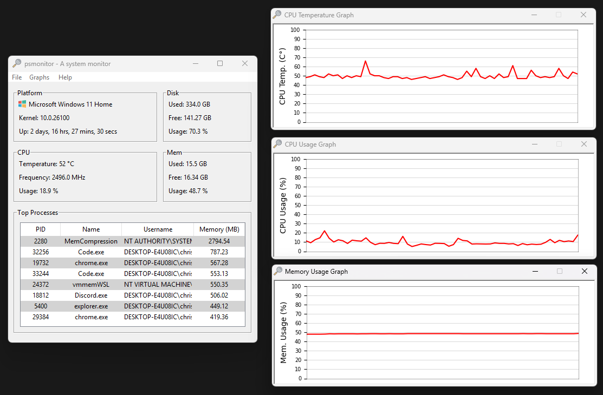

# PSMonitor

[](https://github.com/sentrychris/psmonitor/actions/workflows/github-code-scanning/codeql)

A system and network monitoring app with a headless server for remote monitoring capabilities.



View an example [web client dashboard for remote monitoring here](https://github.com/sentrychris/system-monitor).


## Table of Contents

- [Features](#features)  
- [GUI Application](#gui-application)  
- [Headless Server](#headless-server)  
  - [HTTP](#http)  
  - [Websocket](#websocket)  
  - [Running the Headless Server as a Managed Process](#running-the-headless-server-as-a-managed-process)  
- [Developers](#developers)  
  - [Building from Source](#building-from-source)  
  - [Key points](#key-points)
  - [Authentication](#authentication)
  - [Threading](#threading)  
  - [Developing Custom GUI Windows](#developing-custom-gui-windows)  
- [Connecting to the Headless Server from Your Own App](#connecting-to-the-headless-server-from-your-own-app)  
- [License](#license)  
- [Credits](#credits)


## Features

- **Asynchronous Data Collection**: Efficient, non-blocking data collection.
- **Real-Time Monitoring**: Transmits live system and network statistics.
- **System Statistics**: Provides CPU, memory, and disk usage, uptime, and top processes.
- **Network Statistics**: Monitors data sent and received on network interfaces.
- **Websocket Server**: For remote monitoring on your local network or through port forwarding.
- **Authentication**: For secure access to monitoring endpoints.


## GUI Application

The desktop application is built with [Tkinter](https://docs.python.org/3/library/tkinter.html), Python's binding to the Tk GUI toolkit, it consists of:

- **Core logic**: The collection of modules, scripts and binaries that are used to provide the functionality.
- **The server**: Used by the app to receive data to display, but can also be run as its own headless service.

## Headless Server

The server manages authentication, pairing of client and websocket connections, and the execution of the monitoring scripts, using multiple threads managed through an executor to retrieve data asynchronously and mitigate blocking operations.

While the server is embedded in the desktop GUI application, a [headless version](https://github.com/sentrychris/psmonitor/releases/download/v1.6.0.1001/psmonitor-headless.exe) is provided for people who want to build their own UI clients, or for people who want to setup remote monitoring either on the local network or through port forwarding.

### HTTP

Four standard HTTP endpoints are available:

#### **POST `/authenticate`**:

Authenticates a user and returns a time-limited JWT bearer token.

- Required JSON body:
  ```json
  {
    "username": "your-username",
    "password": "your-password"
  }
  ```

#### **POST `/worker`**:

> Requires a valid bearer token in the **Authorization** header.

Creates a worker to pair HTTP connections to websocket sessions and responds with a worker ID, which is then used in the request to the websocket `/connect` endpoint.

#### **GET `/system`**:

> Requires a valid bearer token in the **Authorization** header.

Retrieves system monitoring information

- **CPU**: Temperature, Frequency, Usage
- **Disk**: Used, Free, Total, Usage
- **Mem**: Used, Free, Total, Usage
- **User**: Logged in user
- **Platform**: Distribution, Kernel, Uptime
- **Processes** Top 10 processes by memory usage


> A small note on CPU temperature monitoring on Windows: reading temperature sensors requires elevated privileges, in order to display your CPU temperature on Windows, you'll need to run PSMonitor as an administrator.
> 
> PSMonitor uses a tiny binary executable called [**libwincputemp**](./lib/libwincputemp/), which is part of this project.

#### **GET `/network`**:

> Requires a valid bearer token in the **Authorization** header.

Retrieves network monitoring information:

- **Interfaces**: Visible network interfaces
- **Wireless**: Name, Quality, Channel, Encryption, Address, Signal
- **Statistics**: For each interface: MB sent, MB received, packets sent, packets received, errors receiving packets, error sending packets, dropout rate.

### Websocket

A single websocket endpoint is available:

#### WS `/connect?id={<worker_id>}&subscriber={<user_id>}`

- Requires a valid worker ID
- Requires a valid user ID (subscriber) tied to the worker.
- Creates and initializes the websocket connection.
- Data immediately begins being sent through the tunnel.

### Running the headless server as a managed process

If you would like to run the [headless server](https://github.com/sentrychris/psmonitor/releases/download/v1.6.0.1001/psmonitor-headless.exe) as a managed process, you can use the systemd [service file](./build_resources/headless/linux/psmonitor.service) provided.

1. Copy the service file and make any necessary changes:
    ```sh
    sudo cp ./psmonitor.service /etc/systemd/system/
    ```

2. Reload the daemon to recognize the new service:
    ```sh
    sudo systemctl daemon-reload
    ```

3. Start the service:
    ```sh
    sudo systemctl start psmonitor
    ```

Alternatively, you could use [supervisor](http://supervisord.org/) or something similar.

## Developers

Please find documentation for developers below.

### Building from Source

To build PSMonitor from source.

Step 1: Clone the repository
```sh
git clone --recurse-submodules https://github.com/sentrychris/psmonitor.git
```

Step 2: Install submodules (all located in `src/lib/`)
```sh
git submodule update --init --recursive
```

Step 3: Create virtualenv:
```sh
python -m venv .venv
```

Step 4: Activate virtualenv:
```sh
.venv\Scripts\Activate.ps1
```

Step 5: Install dependencies
```sh
pip install -r requirements.txt
```

Step 6: Run the `build.py` script to generate a single-file executable:

- GUI: (builds the GUI monitoring app with embedded monitoring server):
    ```sh
    python build.py --build gui --upx 5.0.1 --clean
    ```

- Headless: (builds only the headless monitoring server without the GUI app);
    ```sh
    python build.py --build headless --upx 5.0.1 --clean
    ```

- Pass `--build <gui or headless>` to build either the GUI app or headless server.

- Pass `--upx <upx-ver>` to set the [UPX](https://github.com/upx/upx) version used for packing the executable.

- Pass `--clean` if you want to clean the previous build directories.


### Key points

Most of the code is either documented or self-explanatory, however, some key points:

- Workers act as per-client session handlers that are created whenever a websocket connection is requested. The `WebSocketHandler` binds to a specific `worker` instance associated with that client, enabling individual data streams and cleanup.

- Workers require authentication in order to be created. Once created, the user ID decoded from the JWT access token is assigned to the worker's `subscriber` attribute, which is then checked against the parameter supplied in the request to establish a websocket connection through the `/connect` endpoint.

- Workers that are unclaimed within 5 seconds are removed from the executor thread pool and destroyed.

- Separate threads are used to achieve non-blocking behaviour for blocking calls (e.g. `get_cpu()`, `get_memory()`) by offloading them to the executor thread pool.

- During the packing process, UPX is used to compress the executable, resulting in a file size that is ~10MB smaller.

### Authentication

PSMonitor uses secure authentication to protect access to both HTTP and WebSocket endpoints.

- On first run, a user account is automatically generated.
- A strong password is randomly created, securely hashed, and stored in the embedded database.
- The plaintext password is:
  - Returned via the CLI for headless mode, and
  - Stored securely in the system keyring, scoped to the current user account. for both headless and GUI mode.
- Authentication is handled via time-limited [JWT](https://jwt.io/) access tokens (valid for 1 minute by default).
- Tokens must be included in the `Authorization: Bearer <token>` header for any authenticated endpoints.

### Threading

PSMonitor uses three threading models:

- Tornado's `IOLOOp` async concurrency for non-blocking coroutine execution.

- `ThreadPoolExecutor` for offloading tasks e,g, `psutil` calls like `get_cpu()`.

- `threading.Thread` in the GUI client and for embedding the server and websocket client into the GUI process.

#### In the server

`get_cpu()` and similar functions are CPU-bound or blocking I/O. Therefore these tasks are offloaded to a worker thread in `ThreadPoolExecutor`, allowing the Tornado `IOLoop` to remain non-blocking and continue handling other connections and events.

#### In the GUI 
`threading.Thread` is used to start the Tornado server and the websocket client in separate threads so they do not block the GUI's `mainloop()`.

#### Thread safety with shared data
The core application state, especially the `self.data` dictionary holding system metrics, is shared between the main GUI thread and the websocket client thread.

To avoid data corruption and race conditions when multiple threads access or update `self.data`, PSMonitor uses a thread lock:

- Before a thread reads or modifies `self.data`, it acquires the lock.
- This prevents other threads from accessing `self.data` concurrently.
- Once the operation completes, the lock is released, allowing other threads to proceed.

### Developing Custom GUI Windows.

A reusable template class is provided [here](./build_resources/template/child_handler_template.py) to provide a standard structure for adding new GUI child windows (e.g. graphs, logs, settings) as separate managed components.

#### Template Overview

```python
"""
--------------------------------------------------------------------------
PSMonitor - A simple system monitoring utility
Author: <Author Name>
Copyright: © 2025 Chris Rowles. All rights reserved.
License: MIT
--------------------------------------------------------------------------
"""

import tkinter as tk
# from tkinter import ttk
from typing import TYPE_CHECKING

if TYPE_CHECKING:
    from gui.app_manager import PSMonitorApp

class PSMonitorChildHandlerTemplate:
    """
    Handler template.
    """

    def __init__(self, manager: 'PSMonitorApp' = None) -> None:
        """
        Initializes the handler.
        """

        self._window = None
        self._window_title = "Window Title"
        self._manager = manager


    def open_window(self) -> None:
        """
        Open window.
        """

        if hasattr(self, '_window') and self._window and self._window.winfo_exists():
            if not self._window.winfo_viewable():
                self._window.deiconify()
            self._window.lift()
            return

        self._window = tk.Toplevel(self._manager)
        self._window.title(self._window_title)
        self._window.geometry("450x500")
        self._window.resizable(False, False)
        self._window.protocol("WM_DELETE_WINDOW", self.on_close)


    def is_active(self):
        """
        Check if the window is active.
        """

        return hasattr(self, '_window') and self._window.winfo_exists()


    def close_window(self) -> None:
        """
        Close window.
        """

        if hasattr(self, '_window') and self._window and self._window.winfo_exists():
            self.on_close()


    def on_close(self):
        """
        On close handler
        """

        self._window.destroy()
        del self._window
```

##### Usage

- Copy `child_handler_template.py` and rename the class to match your handler's purpose.

- Replace `"Window Title"` with the desired title for your window.

- Add widgets and layout logic inside `open_window()` or delegate to helper methods.

- Use `is_active()` to check if the window is open from the parent context.

- Use `close_window()` to programmatically close the child window.

##### Guidelines

- Do **not** run blocking code in the child window's context; use threads or delegate to manager objects.

- All UI components should be constructed and destroyed cleanly to avoid orphaned windows or memory leaks.

- Use `self._manager` to interact with shared state, services (like logging), or signal state changes to the core app.


## Connecting to the headless server from your own app

To connect to the server, you can use any client or language.

### JavaScript Example

1. Retrieve the assigned worker:

    ```js
    const client = await fetch(`http://<server-address>`, {
        method: 'POST',
        body: { connection: 'monitor' }
    });
    const worker = await client.json()
    ```

2. Open the WebSocket connection and retrieve data:
    ```js
    const url = `ws://<server-address>:<port>/ws?id=${worker.id}`;

    connection = new WebSocket(url);
    connection.onopen = () => {
        log.write('event', 'websocket is connected');
    }
    connection.onmessage = (response) => {
        const data = JSON.parse(response.data);
    }
    ```

### Python Example

1. Retrieve an assigned worker:

    ```python
    import requests

    response = requests.post('http://<server-address>', json={'connection': 'monitor'})
    worker = response.json()
    ```

2. Open the WebSocket connection and retrieve data:
    ```python
    import asyncio
    import websockets

    async def connect():
        uri = f"ws://<server-address>:<port>/ws?id={worker['id']}"
        async with websockets.connect(uri) as websocket:
            async for message in websocket:
                print(message)

    asyncio.run(connect())
    ```
I hope you like it!

## License
This software is open-sourced software licensed under the MIT license.

## Credits

This software uses [LibreHardwareMonitorLib.dll](https://github.com/LibreHardwareMonitor/LibreHardwareMonitor) in order to provide CPU temperature readings on Windows. The DLL forms part of the **libwincputemp** program which is part of this project. LibreOpenHardwareMonitor is licensed under MPL 2.0, a copy of the license can be found in the [third-party licenses file](./THIRD_PARTY_LICENSES).